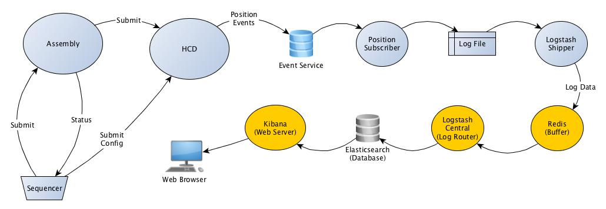

Examples
===========

This directory contains some example code:

* assemblyExample - an example assembly that sends messages to the example HCD
 
* hcdExample - an example HCD that generates position events along with an event subscriber that logs them (for testing)

The conf directory contains some logstash config files to demonstrate logging to LogStash, ElasticSearch and Kibana.

Configuring Logging
-------------------

Applications that wish to log should add the csw log project as a dependency, so that the logback.xml config file
will be found. This configures logging to go to the console and, if the system property "application-name" is
defined, to ${application-name}.log in the directory the application was started in.

Running Logstash, Elasticsearch and the Kibana Web UI
-----------------------------------------------------

Template config files for running Logstash on client and server machines are provided
(and need to be edited for the local environment, to correct the path names to the log files).
This is the basic setup, as described in "The Logstash Book":

On the central log server machine, run:

* redis-server
* elasticsearch --cluster.name=logstash
* logstash agent -f logstashCentral.conf

On the client machines, edit logstashShipper.conf to reference the server and then run:

* logstash agent -f logstashShipper.conf

Then go to http://localhost:9292/ to view the Kibana web UI (replace localhost with the name of the central log host).

The following diagram shows the relationships of the various applications in this demo:

